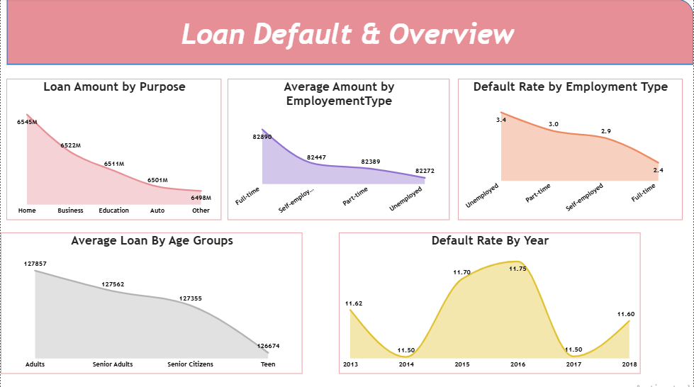
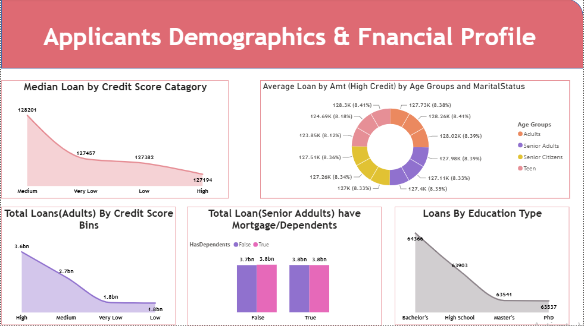
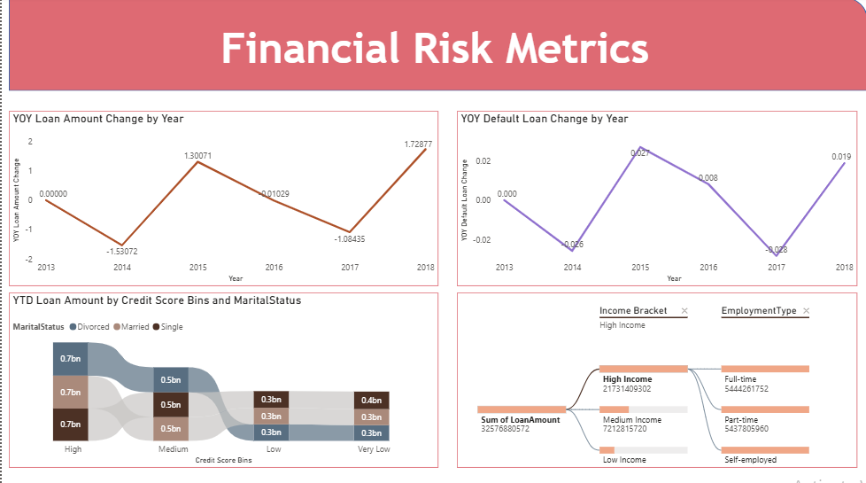

# 📊 Power BI Sales Analysis Dashboard

## 📌 Project Overview

This project is an interactive **Sales Analysis Dashboard** created using **Microsoft Power BI**.

The dashboard focuses on analyzing sales performance and presenting important business insights through interactive visualizations and KPIs.

---

## 🎯 Project Objectives

The main objectives of this project are:

- Analyze overall sales performance
- Track important sales KPIs
- Understand sales trends
- Analyze sales across different categories
- Compare business performance using interactive visuals
- Create an easy-to-understand business dashboard

---

## 🛠️ Tools & Technologies

- **Microsoft Power BI**
- **Power Query**
- **DAX**
- **Data Cleaning & Transformation**
- **Data Visualization**

---

## 📊 Dashboard

The Power BI dashboard contains interactive visualizations and KPI cards to help understand sales performance and business trends.

---

## 🖥️ Dashboard Preview

### Dashboard Page 1

### Dashboard Page 2

### Dashboard Page 3

### Key Dashboard Features

- Sales Performance Analysis
- KPI Cards
- Category-wise Analysis
- Sales Trend Analysis
- Interactive Filters and Slicers
- Business Performance Visualization

---

## 🔍 Key Skills Demonstrated

Through this project, I practiced:

- Data Cleaning
- Data Transformation
- Power Query
- DAX
- Data Modeling
- Data Visualization
- Dashboard Design
- Business Data Analysis

---

## 📁 Project File

| File | Description |
|------|-------------|
| `PowerBI Project 1.pbix` | Power BI dashboard containing the complete sales analysis |

---

## 🚀 Conclusion

This project demonstrates the use of **Power BI** to transform sales data into an interactive and meaningful dashboard.

The dashboard provides a visual representation of sales performance and helps identify important business trends and patterns.

---

## 👨‍💻 Author

**Lovekesh**

B.Tech Computer Science & Engineering
